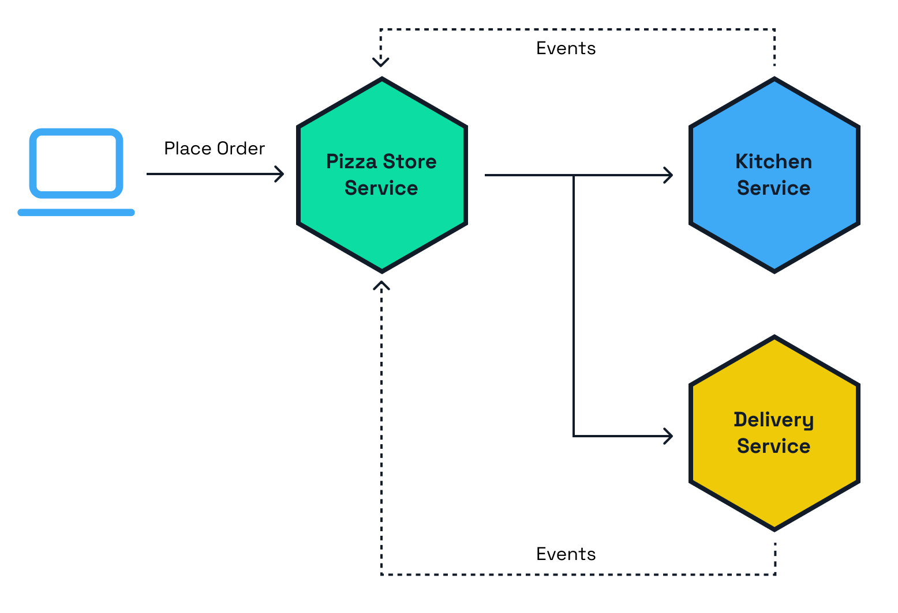
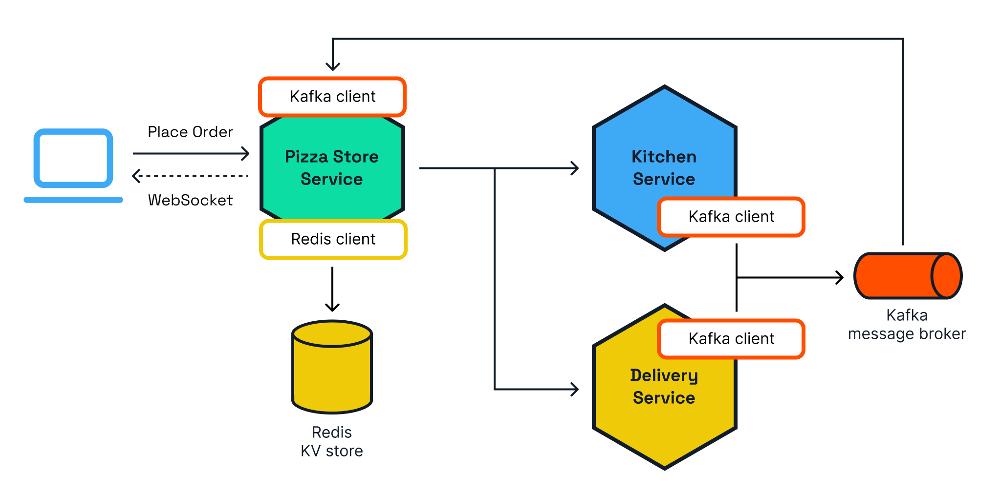
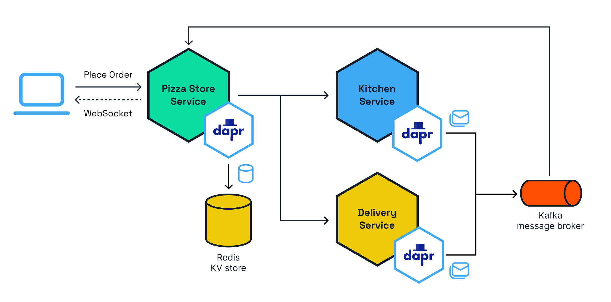

# Conductor Pizza Store

This repository contains an example for a distributed Pizza Store application using Kubernetes, [Dapr](https://dapr.io), [Spring Boot](https://spring.io/projects/spring-boot) and [Testcontainers](https://testcontainers.com) to enable developers with a smooth developer experience.

You can run this application on any Kubernetes cluster by following the step-by-step instructions described in this document. [Diagrid Conductor](https://www.diagrid.io/conductor) is used to monitor the health of the applications and get insights related to the Dapr configuration.


The Pizza Store application simulates placing a Pizza order that is going to be processed by different services. The application is composed by the Pizza Store Service which serves as the front-end and back-end to place the order. The order is sent to the Kitchen Service for preparation and once the order is ready to be delivered the Delivery Service takes the order to your door.



These services will need to store and read data from a state store, and exchange messages via a message broker to enable asynchronous communication. In this case Redis and Kafka are used, as these are well-known components among developers.



As you can see in the diagram, if we want to connect to Redis from the Pizza Store Service we need to add to our applications the Redis client that must match with the Redis instance version that we have available. A Kafka client is required in all the services that are interested in publishing or consuming messages/events. Because you have Drivers and Clients that are sensitive to the available versions on the infrastructure components, the lifecycle of the application is now bound to the lifecycle of these components.

Adding Dapr to the picture not only breaks these dependencies, but also remove responsibilities from developers of choosing the right Driver/Client and how these need to be configured for the application to work correctly. Dapr provides developers building block APIs such as the StateStore and PubSub API that developer can use without know the details of which infrastructure is going to be connected under the covers.



When using Dapr, developers can trust that the [building block APIs](https://docs.dapr.io/concepts/building-blocks-concept/) are stable, while the teams in charge of the infrastructure can swap versions and services without impacting the application code or behavior. 

## Prerequisites

1. For this demo you need a Diagrid Conductor account. Sign up for a free account at [diagrid.io/conductor](https://www.diagrid.io/conductor).
2. To run a kind cluster locally you need [Docker Desktop](https://www.docker.com/products/docker-desktop/), [kind](https://kind.sigs.k8s.io/), and [helm](https://helm.sh/docs/intro/install/).

The demo comes with a front-end to place orders manually and see their progress. However, orders can also be placed direcly to the back-end with a REST client, such as the [VS Code REST Client](https://marketplace.visualstudio.com/items?itemName=humao.rest-client). To execute multiple order requests [Ddosify](https://github.com/ddosify/ddosify) can be used.

> **The easiest way to run the demo is to use the devcontainer and open it in VSCode (requires Docker Desktop) or in a GitHub Codespace.** The devcontainer has the following preinstalled:
>  - kind & helm
>  - Ddosify
>  - VSCode REST client extension
>  - CodeTour extension

## Installation

1. Once you have kind installed, you can run the following command to create a local cluster:

```bash
kind create cluster

kubectl cluster-info --context kind-kind
```

2. Create a new Conductor cluster in the [Conductor dashboard](https://conductor.diagrid.io/). Choose for a local cluster type (kind/minikube) and enable metrics server installation.


3. Once the cluster is created in Conductor, click the _Connect Cluster_ button to get the link to the manifest file that will install the Conductor agent. Copy the `kubectl apply ...` link and run it locally. 

```bash
kubectl apply -f "https://api.diagrid.io/apis/diagrid.io/v1beta1/clusters\<CLUSTER-ID\>manifests?token=\<TOKEN\>"
```

3. Check the progress of the Dapr pods creation:

```bash
kubectl get pods --all-namespaces
```

## Installing infrastructure for the application

1. Redis is used as the key/value store that is used by the Dapr State Managemenr API. Install Redis via helm:

```bash
helm repo add bitnami https://charts.bitnami.com/bitnami
helm repo update
helm install redis bitnami/redis --set image.tag=6.2 
```

2. Kafka is used as the message broker for async communication between services. Install Kafka via helm:

```bash
helm install kafka oci://registry-1.docker.io/bitnamicharts/kafka --version 22.1.5 --set "provisioning.topics[0].name=events-topic" --set "provisioning.topics[0].partitions=1" --set "persistence.size=250Mi"
```

## Installing the application

To install the services you only need to run the following command:

```bash
kubectl apply -f k8s/
```

This installs all the application services. To avoid dealing with Ingresses you can access the application by using `kubectl port-forward`, run to access the application on port `8080`:

```bash
kubectl port-forward svc/pizza-store 8080:80
```

## Running the application (front-end)

Then you can point your browser to [`http://localhost:8080`](http://localhost:8080) and you should see:


Make a few orders and use the [Conductor dashboard](https://conductor.diagrid.io/) to inspect the metrics charts and get insights on the distributed application.

## Running the application (Ddosify or REST client)

To execute many requests to the order endpoint you use Ddosify.

1. Update the IP address in the [ddosify_order.json](./pizza-store/ddosify_order.json) file.
2. Run `bash run.sh` in the root of this repo.

To execute individual requests use the [test.rest](./test.rest) file with the VSCode REST client.

## Building from source / changing the services

The application services are written using Java + Spring Boot. These services use the Dapr Java SDK to interact with the Dapr [PubSub](https://docs.dapr.io/getting-started/quickstarts/pubsub-quickstart/) and [Statestore](https://docs.dapr.io/getting-started/quickstarts/statemanagement-quickstart/) APIs.

To run the services locally you can use the [Testcontainer](https://testcontainaers.com) integration already included in the projects.

For example you can start a local version of the `pizza-store` service by running the following command inside the `pizza-store/` directory (this requires having Java and [Maven](https://maven.apache.org/) installed locally):

```bash
mvn spring-boot:test-run
```

This, not only start the `pizza-store` service, but it also uses the [Testcontainers + Dapr Spring Boot](https://central.sonatype.com/artifact/io.diagrid.dapr/dapr-spring-boot-starter) integration to configure and wire up a Dapr configuration for local development. In other words, you can now use Dapr outside of Kubernetes, for writing your service tests without the need to know how Dapr is configured.

Once the service is up, you can place orders and simulate other events coming from the Kitchen and Delivery services by sending HTTP requests to the `/events` endpoint.

In the application you should see events that indicate the progress of the order.

## More information

Do you want to learn more about Conductor? Join the [Diagrid Discourse](https://community.diagrid.io/invites/TJkNYwdh1y) where developers and platform engineers share knowledge on running distributed applications at scale with Dapr.
